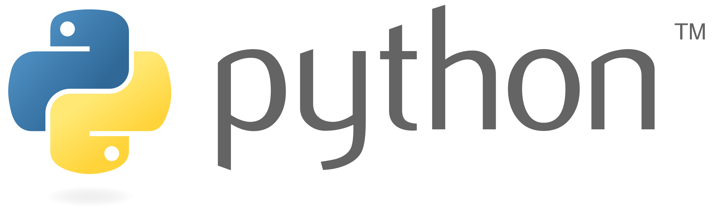

# COMP350: Advanced Programming in Python

This repository contains all of the code and labs for COMP350: Advanced Programming in Python.

The course is structured as follows:

## Part I: Introduction to git

## Part II:Introduction to Python

## Part III: Beyond the basics

## Part IV: Advanced topics

